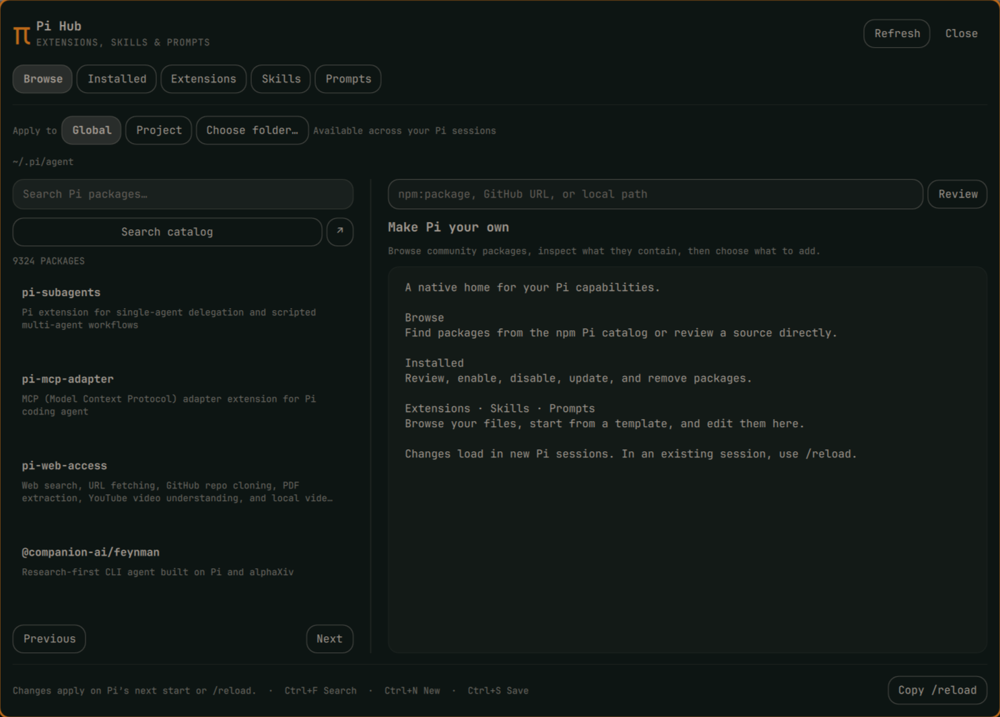

# Pi Hub

**Manage your Pi capabilities from a native Omarchy panel.** Browse packages, inspect source, manage installations, and create extensions, skills, and prompt templates without leaving your desktop.

Click **π** in the bar to open Pi Hub. It follows your Omarchy theme and works without a provider account, API key, model call, background service, or companion Pi extension.



## Requirements

Pi Hub targets **Linux with Omarchy's Quickshell shell**. Tested with Omarchy **4.0.2**, Quickshell **0.3.1**, Qt **6.11.2**, and Pi **0.85.1**. Older releases and other desktops are not verified. Python **3.11+** is required; the backend uses only the standard library.

| Dependency | Used for |
| --- | --- |
| [Pi](https://pi.dev), available on the desktop session's `PATH` | Installing and removing Pi packages |
| npm and Git | Package operations; GitHub source review |
| `wl-copy` from `wl-clipboard` | Copy buttons |
| `zenity` (optional) | Graphical project folder picker; you can also enter a folder directly |

Use Pi's installation instructions to install Pi first. Pi Hub does not install system dependencies or ask for root access. Its native UI uses Omarchy's `KeyboardPanel`, `Dropdown`, and plugin APIs; it is not a standalone Qt application.

## Install

Review this repository, then install through Omarchy:

```sh
omarchy plugin add https://github.com/dlpwaters/omarchy-pi-hub.git --enable
```

Choose a bar section when prompted. The plugin ID is `io.github.dlpwaters.pi-hub`. If you already have the older Pi Hub launcher installed, back up its folder before replacing it; the add command refuses an existing plugin ID.

Open it with the **π** bar button or use this command in a shortcut:

```sh
omarchy-shell io.github.dlpwaters.pi-hub toggle
```

The bundled `bin/pi-hub` opens the same native panel. The older `/pi-hub` Pi extension is independent and can remain installed.

## Find, review, and install

1. Choose **Global** for your personal Pi configuration, or **Project** and an existing absolute project folder. Check the destination displayed below the scope controls.
2. In **Browse**, search npm's `pi-package` catalog or paste a source. Supported sources include `npm:package-name`, `npm:@scope/name@1.2.3`, an absolute local package path, and `https://github.com/owner/repository` with an optional `@branch`, `@tag`, or `@commit`.
3. Read the README, manifest, warnings, and source previews. npm versions and GitHub references are resolved before review. Select **Trust this source** only if you trust the package and its dependencies.
4. Select **Install** and confirm the source and destination.
5. Start a new Pi session or use **Copy /reload** and paste it into an existing session.

Pi Hub cannot reload unrelated running Pi sessions. Project package operations use Pi's one-command approval after your explicit confirmation; they do not permanently mark a project trusted.

## Manage and create

| Tab | What you can do |
| --- | --- |
| **Browse** | Search packages, inspect metadata and source, install a reviewed source |
| **Installed** | Review files or an update, enable/disable a package, remove it |
| **Extensions** | Read and edit local code; create slash-command, custom-tool, or permission-hook starters |
| **Skills** | Browse and edit `SKILL.md` files; create a named skill with a description |
| **Prompts** | Browse and edit Markdown templates; start with review, debugging, or documentation prompts |

Editors preserve the complete source and frontmatter. Adapt extension starter identifiers before loading them. Prompt filenames become `/name`; Pi templates use positional arguments such as `$1`, `$2`, and `$@`. Skills can be invoked as `/skill:name`.

Package-provided and shared resources are read-only. Create an owned local copy when you want to customize them. Discovery covers conventional Pi directories, shared `.agents/skills`, and common installed package layouts; unusual custom resource globs may require Pi's own configuration tools.

**Keyboard:** Ctrl+F searches, Ctrl+N creates a resource in a library tab, Ctrl+S saves, Escape closes, and Tab moves between controls. Save/discard prompts protect drafts during navigation. Closing preserves an unsaved draft in memory; restarting the shell loses it.

## Safety and privacy

Pi Hub and Pi extensions run with your user permissions. Source review is a reading aid, not a sandbox or a guarantee that third-party code is safe.

- Package installation and updates require a source- and scope-bound review followed by confirmation. Review tokens expire after 30 minutes.
- npm lifecycle scripts are disabled during package operations. Packages needing those scripts require deliberate manual setup. An extension can still execute arbitrary code once Pi loads it.
- Reviews use bounded downloads and plain-text previews. A changed reviewed source is rejected before installation. The final Pi/npm download retains the normal registry trust boundary; dependencies are not exhaustively audited.
- File writes check revisions, back up previous content, and use atomic replacement. Managed-path checks restrict editor writes. Deletes use recoverable trash with **Undo delete**.
- Package/resource toggles preserve unrelated Pi settings and original package filters. Pi Hub never updates Pi itself.
- No telemetry or credential collection is included. npm searches send your query to npm; package review/install contacts npm, GitHub, or the package's download host. Local resource contents are not uploaded by Pi Hub.

See [SECURITY.md](SECURITY.md) for the trust boundary and vulnerability reporting.

## Configuration and stored data

Paths are derived from the current user's environment and the selected project; there is no developer home directory or personal configuration bundled with the plugin.

| Location or setting | Purpose |
| --- | --- |
| `~/.pi/agent` or `PI_CODING_AGENT_DIR` | Global Pi resources and settings |
| `<project>/.pi` | Project resources and settings |
| `$XDG_STATE_HOME/pi-hub` (default `~/.local/state/pi-hub`) | Backups, recoverable trash, review tokens, and private locks |
| `~/.config/omarchy/pi-hub.ini` | Remembered scope and project folder |
| `PI_HUB_PI` | Optional absolute path to the Pi executable, inherited by the desktop session |

Backups and trash can contain your resource content. They remain local and are not part of this repository. No global keybinding is installed.

## Update or remove

Update the plugin through Omarchy:

```sh
omarchy plugin update io.github.dlpwaters.pi-hub
```

Remove it through Omarchy:

```sh
omarchy plugin remove io.github.dlpwaters.pi-hub
```

Removal unloads the plugin and removes its installed repository. It leaves Pi, installed Pi packages, your skills/prompts/extensions, and recovery data intact. Save any changes to the plugin's own source elsewhere before removal. You can separately delete `~/.config/omarchy/pi-hub.ini` and the Pi Hub state directory when you no longer need its preferences or backups.

## Troubleshooting

- **Pi is unavailable:** ensure the desktop session can find `pi`, npm, and Git. A terminal-only PATH modification may not reach Quickshell. Set `PI_HUB_PI` in your session environment to an absolute executable if needed; a conventional Mise installation is also detected as a fallback.
- **Changes are missing in Pi:** run `/reload` in that session, and check that you selected the intended global/project scope.
- **Folder picker or copy fails:** install `zenity` or `wl-clipboard`, respectively. A folder can be entered without the picker.
- **The old widget remains after an update:** save drafts, then run `omarchy restart shell`.
- **Review rejects a source:** only npm, local paths, and HTTPS GitHub repositories are supported. Other Git hosts, SSH sources, Git checkout filters (including LFS), oversized downloads, and expired or changed reviews are rejected. GitHub static review supports public repositories and ignores personal Git configuration.

## Development

```sh
./check.sh
```

This runs isolated backend tests, Python compilation, manifest parsing, QML lint, Omarchy validation, and diff checks. `OMARCHY_PATH` can override the default `/usr/share/omarchy` shell root. GitHub Actions runs portable backend checks; native UI validation requires an Omarchy desktop.

For an integration check against the real Pi CLI, set its actual executable path (a version-manager shim may fail under the isolated test home):

```sh
PI_HUB_PI=/absolute/path/to/pi python3 scripts/acceptance.py
```

The integration check isolates HOME, XDG configuration/data/cache/state, and Pi's agent directory. It verifies resource loading and package operations without model prompts. For a Mise installation, obtain the executable path with `mise which pi`.

`BarWidget.qml` owns bar/IPC integration, `Panel.qml` owns the interface, and `hub.py` handles one JSON request per process over stdin/stdout. See [docs/STATUS.md](docs/STATUS.md) for verification and remaining compatibility limits. Contributions should include focused behavior checks and live validation for UI changes.

## License

[MIT](LICENSE). Pi Hub is an independent community plugin for [Omarchy](https://omarchy.org) and [Pi](https://pi.dev).
